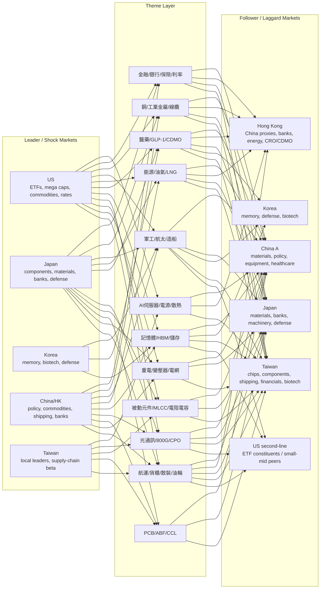

# Lagradar Cross-Market Theme Relation Graph

Generated from `lagradar/data/cross_market_theme_seed.json`. This is a trading map, not a full company encyclopedia.

## Signal Flow

```mermaid
flowchart LR
  Shock["Leader shock
price / earnings / policy / commodity / rates"] --> Relation["Relation graph
same industry / supply chain / macro exposure"]
  Relation --> Heat["Theme heat
leader 20D/60D + breadth"]
  Heat --> Gap["Laggard gap
leader move - follower move"]
  Gap --> Turn["Turn confirmation
3D/5D/10D + volume + MA reclaim + breakout"]
  Turn --> Diffusion["Diffusion breadth
multiple peers confirm"]
  Diffusion --> Overheat["Overheat check
20D MA distance / crowded volume / climax"]
  Overheat --> Candidate["Improving laggard watchlist
trigger + invalidation + size cap"]
```

## Cross-Market Map

## Theme Adjacency

| Theme | Leader markets | Follower markets | Typical path |
|---|---|---|---|
| 被動元件/MLCC/電阻電容 | JP, TW, US | CN, JP, TW | leader shock -> lag gap -> turn confirmation -> overheat check |
| 重電/變壓器/電網 | CN, JP, US | CN, JP, TW | leader shock -> lag gap -> turn confirmation -> overheat check |
| 記憶體/HBM/儲存 | CN, KR, US | CN, KR, TW, US | leader shock -> lag gap -> turn confirmation -> overheat check |
| AI伺服器/電源/散熱 | TW, US | CN, HK, TW | leader shock -> lag gap -> turn confirmation -> overheat check |
| PCB/ABF/CCL | CN, JP, TW | CN, JP, TW | leader shock -> lag gap -> turn confirmation -> overheat check |
| 光通訊/800G/CPO | CN, JP, TW, US | CN, JP, TW, US | leader shock -> lag gap -> turn confirmation -> overheat check |
| 銅/工業金屬/線纜 | CN, JP, US | CN, HK, JP, TW | leader shock -> lag gap -> turn confirmation -> overheat check |
| 能源/油氣/LNG | HK, JP, US | CN, HK, JP, TW | leader shock -> lag gap -> turn confirmation -> overheat check |
| 航運/貨櫃/散裝/油輪 | CN, JP, TW, US | CN, HK, JP, TW, US | leader shock -> lag gap -> turn confirmation -> overheat check |
| 軍工/航太/造船 | CN, JP, KR, US | CN, JP, KR, TW, US | leader shock -> lag gap -> turn confirmation -> overheat check |
| 醫藥/GLP-1/CDMO | JP, KR, US | CN, HK, JP, KR, TW | leader shock -> lag gap -> turn confirmation -> overheat check |
| 金融/銀行/保險/利率 | CN, HK, JP, US | CN, HK, JP, TW | leader shock -> lag gap -> turn confirmation -> overheat check |

## Current Backtest Read-Through

- Stronger historical diffusion buckets so far: optical/CPO, memory/HBM, PCB/ABF/CCL, passive components, AI server power/thermal, copper/industrial metals.
- Weaker or more conditional buckets so far: energy/oil/LNG and shipping/freight. They need stricter commodity/freight-rate and macro controls before promotion.
- All backtest rows are raw research signals; the next layer should neutralize market, sector, country, FX, rates, commodity, and own momentum.
